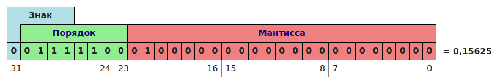
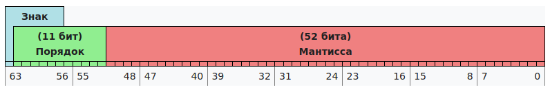
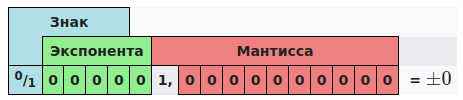
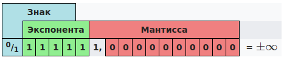
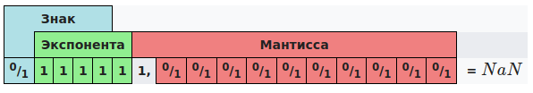
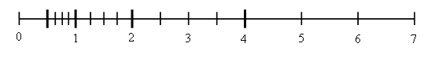
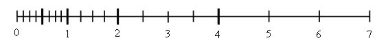

# Представление чисел с плавающей точкой в памяти компьютера

## Экспоненциальная запись действительных чисел

Привычный способ записи действительных чисел "0,25" становится неудобным, когда нужно записывать очень большие или очень маленькие числа:

* 2500000000
* 0,0000000025

Поэтому в науке и инженерии часто используют другой способ записи: **экспоненциальную запись** (Scientific notation). 

Экспоненциальная запись - это представление действительных чисел в виде: 

, где

- N — записываемое число;
- M — мантисса;
- n — основание показательной функции;
- p (целое) — порядок;
- n^p — характеристика числа.

Примеры:

* 1 000 000 (один миллион): 


* 1 201 000 (один миллион двести одна тысяча): 


* −1 246 145 000 (минус один миллиард двести сорок шесть миллионов сто сорок пять тысяч): 


* 0,000001 (одна миллионная): 


* 0,000000231 (двести тридцать одна миллиардная): 


Любое данное число может быть записано в экспоненциальной форме многими путями; например 350 может быть записано как 3,5 * 10^2 или 35 * 10^1.

В **нормализованной** научной записи порядок p выбирается такой, чтобы абсолютная величина M  оставалась не меньше единицы, но строго меньше десяти. Например, 350 записывается как 3,5 * 10^2. Этот вид записи, называемый также **стандартным видом**, позволяет легко сравнивать два числа. 

## Запись чисел с плавающей точкой в памяти компьютера

Числа с плавающей точкой хранятся в памяти компьютера в экспоненциальной форме: хранятся знак, мантисса (значение числа без учёта порядка) и порядок числа. Используемое наиболее часто представление утверждено в стандарте IEEE 754. 

Мантисса двоичного числа в нормализованной форме принимает значения от 1 (0b01) до 2 (0b10). В такой форме любое число (кроме 0) записывается единственным образом. Недостаток заключается в том, что в таком виде невозможно представить 0, поэтому ноль записывается особым образом, мы рассмотрим это далее.

Старший разряд (целая часть числа) мантиссы двоичного числа (кроме 0) в нормализованном виде равен 1 (так называемая неявная единица), поэтому при записи мантиссы числа в ЭВМ старший разряд можно не записывать, что и используется в стандарте IEEE 754.

Наиболее часто используются 32-битные (одинарная точность) представления чисел с плавающей точкой и 64-битные (двойная точность). Реже используются следующие форматы чисел:

-  половинной точности (half precision) (16 бит),
-  четверной точности (quadruple precision) (128 бит),
-  расширенной точности (extended precision) (80 бит).

При выборе формата программисты идут на разумный компромисс между точностью вычислений и размером числа.

Итак, число с плавающей точкой хранится в нормализованной форме и состоит из трех частей:

1.  знак
2.  порядок (показатель степени) (в виде целого беззнакового числа со сдвигом)
3.  мантисса (в нормализованной форме без записи неявной единицы)

В качестве базы (основания степени) используется число 2

### Числа одинарной точности

Экспонента хранится со сдвигом −127.



Для вычисления показателя степени из восьмиразрядного поля порядка вычитается смещение порядка, равное 127 =  0x7F = 0b01111111 (в примере на картинке 0b01111100 - 0b01111111 = 124 - 127 = -3). Так как в нормализованной двоичной мантиссе целая часть всегда равна единице, то в поле мантиссы записывается только её дробная часть,т.е. фактический размер мантиссы числа с одинарной точностью составляет 24 бита. Для вычисления мантиссы к единице добавляется дробная часть мантиссы из 23-разрядного поля дробной части мантиссы 0b1.01000000000000000000000. Число равно произведению мантиссы со знаком на двойку в степени порядка = 0b1,01 * 2^(-3) = 0b101 * 2^(-5) = 5 * 2^(-5) = 0,15625.

### Числа двойной точности

Экспонента хранится со сдвигом −1023.



Итоговое значение числа вычисляется аналогично примеру выше по формуле: 


## Запись нуля, бесконечности и NaN

### Ноль (со знаком)

В нормализованной форме невозможно представить ноль. Для его представления в стандарте зарезервированы специальные значения мантиссы и экспоненты.

В IEEE754 число «0» представляется значением с порядком, равным E = Emin - 1 (для single precision это -127) и нулевой мантиссой. 



В описанном представлении чисел с плавающей запятой существует два нуля, которые отличаются только знаком. Так, 3 * (+0) = +0, а 3 * (-0) = -0. Но при  сравнении +0 == -0. В стандарте знак сохранили умышленно, чтобы выражения, которые в результате переполнения или потери значимости превращаются в бесконечность или в ноль, при умножении и делении все же могли представить максимально корректный результат. Например, если бы у нуля не было знака, выражение 1 / (1 / x) = x не выполнялось бы верно при x=±∞, так как 1/(+∞) и 1/(-∞) равны 0.

Согласно стандарту выполняются следующие свойства:

-  +0 = −0
-  −0 / |*x*| = −0 (если *x* ≠ 0)

* (−0) * (−0) = +0
* |*x*| * (−0) = −0
* *x* + (±0) = *x*
* (−0) + (−0) = −0
* (+0) + (+0) = +0
* −0 / −∞ = +0
* |*x*| / −0 = −∞ (если *x* ≠ 0)

### Бесконечность (со знаком)

Для приближения ответа к правильному при переполнении, в double можно  записать бесконечное значение. Так же, как и в случае с нулём, для этого используются специальные значения мантиссы и экспоненты.

Бесконечное значение можно получить при переполнении или при делении ненулевого числа на ноль.

Бесконечности представлены как числа с порядком E = Emax + 1 и нулевой мантиссой.



### Неопределённость (NaN)

*Неопределенность* или NaN (от not a number) – это представление,  придуманное для того, чтобы арифметическая операция могла всегда вернуть какое-то не бессмысленное значение, даже в случае ошибки. В IEEE754 NaN представлен как число, в котором E=Emax + 1, а мантисса не нулевая. Любая операция с NaN возвращает NaN. При желании в мантиссу можно записывать информацию, которую программа сможет интерпретировать. Стандартом это не оговорено и мантисса чаще всего игнорируется. 

По определению NaN ≠ NaN, поэтому, для проверки значения переменной нужно просто сравнить ее с собой.



Неопределенность можно получить в нескольких случаях. Приведем некоторые из них:

-  *f*(*NaN*) = *NaN*, где *f* \- любая арифметическая операция
- ∞ + (−∞) = *NaN*
- 0 * ∞ = *NaN*
- ±0 / ±0 = ±∞ / ±∞ = *NaN*
- sqrt(x) = *NaN*, где *x*<0

## Денормализованные числа

Рассмотрим проблему записи околонулевых значений с помощью описанного выше представления чисел.

Пусть имеем нормализованное представление с длиной мантиссы |M|=2 бита (плюс неявная единица) и диапазоном значений порядка -1 ≤ E ≤ 2. В этом случае получим 16 чисел:

 

Крупными штрихами показаны числа с мантиссой, равной 1.00. Видно, что расстояние от нуля до ближайшего числа (0 — 0.5) больше, чем от этого  числа к следующему (0.5 — 0.625). Это значит, что разница двух любых чисел от 0.5 до 1 даст 0, даже если эти числа не равны. Также в пропасть между 0.5 и 0 попадает разница чисел, больших 1. Например, 1.5 - 1.25 = 0.

Денормализованные (denormalized numbers) - способ увеличить количество представимых чисел в окрестности нуля. 

Мы знаем, что при E = Emin - 1 (для single precision это -127) и нулевой мантиссе число считается равным нулю. Если же мантисса не нулевая, то  число считается не нулевым, его порядок полагается E = Emin, причем неявный старший бит мантиссы полагается равным нулю. Такие числа называются *денормализованными*. Каждое такое число по модулю меньше самого маленького нормализованного. 

С учётом вышесказанного числа с плавающей точкой можно представлять в следующем виде:

- (−1)^*s* * 1.*M* * 2^*E*, в нормализованном виде если *Emin* ≤ *E* ≤ *Emax*
- (−1)^*s* * 0.*M* * 2^*Emin*, в денормализованном виде если *E* = *Emin* − 1

, где 

* *Emin* \- минимальное значение порядка, используемое для записи чисел, 

* *Emin* − 1 - минимальное значение порядка, которое он может принимать - все биты нули.

Вернемся к примеру. Наш Emin = -1. Введем новое значение  порядка, E = -2, при котором числа являются денормализованными. В результате получаем новое представление чисел:

 

 Интервал от 0 до 0.5 заполняют денормализованные числа, что дает  возможность не проваливаться в 0 рассмотренных выше примерах (0.5 - 0.25 и 1.5 - 1.25). Это сделало представление более устойчиво к ошибкам  округления для чисел, близких к нулю. 

Но использование денормализованного представления чисел в процессоре не дается бесплатно. Из-за того, что такие числа нужно обрабатывать по-другому во всех арифметических операциях, трудно сделать работу в такой арифметике эффективной. Это накладывает дополнительные сложности при реализации АЛУ в процессоре. И хоть денормализованные числа очень полезны, они не являются панацеей, и за округлением до нуля все равно нужно следить. 

## Точность записи чисел

У 32-битных чисел с плавающей запятой точность примерно 24 бита, то есть около 7 десятичных знаков, а у чисел с двойной точностью — 53 бита, то  есть примерно 16 десятичных знаков. 

При этом число с плавающей запятой имеет фиксированную относительную точность и изменяющуюся абсолютную. То есть, точность записи числа зависит от его величины. 

Вот некоторые  грубые оценки того, какую точность вы получаете в худшем случае при  использовании чисел одинарной и двойной точности для измерения объектов в разных диапазонах:

| Масштаб                   | Одинарная точность | Двойная точность             |
| ------------------------- | ------------------ | ---------------------------- |
| Размер комнаты            | микрометр          | радиус протона               |
| Окружность Земли          | 2,4 метра          | нанометр                     |
| Расстояние до Солнца      | 10 км              | толщина человеческого волоса |
| Продолжительность суток   | 5 миллисекунд      | пикосекунда                  |
| Продолжительность столетия | 3 минуты           | микросекунда                 |
| Время от Большого взрыва  | тысячелетие        | минута                       |

Если вы измеряете размер квартиры, то достаточно одинарной точности. Но если хотите представить координаты GPS с точностью менее метра, то понадобится число двойной точности.

Сетка чисел, которые способна отобразить арифметика с плавающей запятой, неравномерна: она более густая для чисел с малыми порядками и более  редкая — для чисел с большими порядками. Но относительная погрешность записи чисел одинакова и для малых чисел, и для больших. *Машинным эпсилоном* называется наименьшее положительное число ε такое, что 1.0 ⊕ ε ≠ 1 (знаком ⊕ обозначено машинное сложение). Числа *a* и *b*, соотносящиеся так, что 1 < a / b < 1 + ε, машина не различает.

Для одинарной точности ε = 2^(-24) ≈ 5.96 * 10^(-8). Для двойной точности: ε = 2^(-53) ≈ 1.11 * 10^(-16).

## Основные моменты кратко

1. В нормализованном виде любое отличное от нуля число представимо единственным образом. Недостатком такой записи является тот факт, что  невозможно представить число 0.

2. Так как старший бит двоичного числа, записанного в нормализованной  форме, всегда равен 1, его можно опустить. Это используется в стандарте  IEEE 754.

3. В отличие от целочисленных стандартов (например, integer), имеющих  равномерное распределение на всем множестве значений, числа с плавающей  точкой (double, например) имеют квазиравномерное распределение.

4. Вследствие свойства 3, числа с плавающей точкой имеют постоянную  относительную погрешность (в отличие от целочисленных, которые имеют  постоянную абсолютную погрешность).

5. Очевидно, не все действительные числа возможно представить в виде числа с плавающей точкой.

6. Точно в таком формате представимы только числа, являющиеся суммой обратных степеней двойки (которые позволяет записать используемая точность, до -53 для двойной точности). Остальные числа  попадают в некоторый диапазон и округляются до ближайшей его границы.  Таким образом, абсолютная погрешность составляет половину величины  младшего бита.

7. В формате double представимы числа в диапазоне [2.3 * 10^(−308), 1.7 * 10^(308)].

## Задачи

Ниже будут приведены фрагменты кода. Они не являются образцом написания кода, ваши коллеги не будут рады увидеть такое. Не пишите так без острой необходимости (в спортивном программировании можно :-) ).

### Округление float до ближайшего целого

Давайте попробуем округлить число с плавающей точкой до ближайшего целого, используя то, что при росте значения числа с плавающей точкой его абсолютная точность падает. Увеличьте число с плавающей точкой настолько, чтобы дробная часть потерялась, затем уменьшите его обратно.

Решение:

```c++
#include <iostream>

/**
 * @brief Округляет число с плавающей точкой до ближайшего целого.
 * @param number Число, которое нужно округлить.
 * @return Округлённое до ближайшего целого.
 */
static float round_positive_float(float number) {  // Для какого диапазона чисел это будет работать корректно?
    const uint32_t magic_const = 0x4b000000;
    const float* magic_const_float = reinterpret_cast<const float*>(&magic_const);
    return (number + *magic_const_float) - *magic_const_float;
}


int main()
{
    std::cout << round_positive_float(2.3f) << std::endl;
    std::cout << round_positive_float(5.7f) << std::endl;
    std::cout << round_positive_float(11.5f) << std::endl;

    return 0;
}
```

### Целочисленное логарифмирование по основанию 2

Некоторые алгоритмы (например, fft) требуют для работы, чтобы количество значений на входе алгоритма было равно степени двойки. Поэтому при реализации таких алгоритмов входные данные дополняют незначащими значениями (например, нулями) до нужной длины. Давайте найдём эту нужную длину.

Попробуйте, используя знание о представлении чисел с плавающей точкой в памяти, найти для целого числа значение логарифма по основанию 2, округлённое до ближайшего большего целого (нужно вытащить порядок числа из его представления как числа с плавающей точкой).

Решение:

```c++
#include <iostream>

/**
 * @brief Определяет значение логарифма по основанию 2, округлённое до ближайшего не меньшего целого.
 * @details Используется знание о представлении чисел с плавающей точкой в памяти.
 * @details Подробнее: https://ru.wikipedia.org/wiki/Число_двойной_точности
 * @param number Число, которое нужно логарифмировать.
 * @return Значение логарифма по основанию 2, округлённое до ближайшего не меньшего целого.
 */
static uint64_t log2(uint64_t number) {
    double x = static_cast<double>(number - 1);  // Попробуйте разобраться с этой единицей (если её убрать, то "не меньшего" в описании функции нужно заменить на "строго большего")
    auto tmp = reinterpret_cast<uint32_t*>(&x) + 1;  // Что здесь происходит?
    return (((*tmp & 0x7FF00000) >> 20) - 1022);  // Почему здесь 1022?
}

int main()
{
    std::cout << log2(4) << std::endl;
    std::cout << log2(5) << std::endl;
    std::cout << log2(6) << std::endl;
    std::cout << log2(7) << std::endl;
    std::cout << log2(8) << std::endl;

    return 0;
}
```

Получить не значение логарифма, а искомую длину (2 в степени найденного выше значения логарифма) легко с помощью битового сдвига единицы на значение логарифма:

```c++
int main()
{
    std::cout << (1UL << log2(4)) << std::endl;
    std::cout << (1UL << log2(5)) << std::endl;
    std::cout << (1UL << log2(6)) << std::endl;
    std::cout << (1UL << log2(7)) << std::endl;
    std::cout << (1UL << log2(8)) << std::endl;

    return 0;
}
```

### Приближённое вычисление обратного к квадратному корню

В начале 2000-х годов в программистских кругах наблюдалось определённое оживление, связанное с найденной удивительной подпрограммой вычисления приближенного значения, обратного к квадратному корню значения в формате числа с плавающей точкой одинароной точности. Такая подпрограмма весьма полезна в графических приложениях, например, для нормализации вектора путём умножения его компонент x, y, z на 1 / sqrt(x^2 + y^2 + z^2). Попробуйте разобраться с кодом этой функции на языке C:

```c
float rsqrt(float x0) {
    union {
        int ix;
        float x;
    };
    
    x = x0;  // x можно рассматривать как int
    float xhalf = 0.5f * x;
    ix = 0x5f375a82 - (ix >> 1);  // Начальная оценка
    x = x * (1.5f - xhalf * x * x);  // Шаг алгоритма Ньютона
    return x;
}
```


